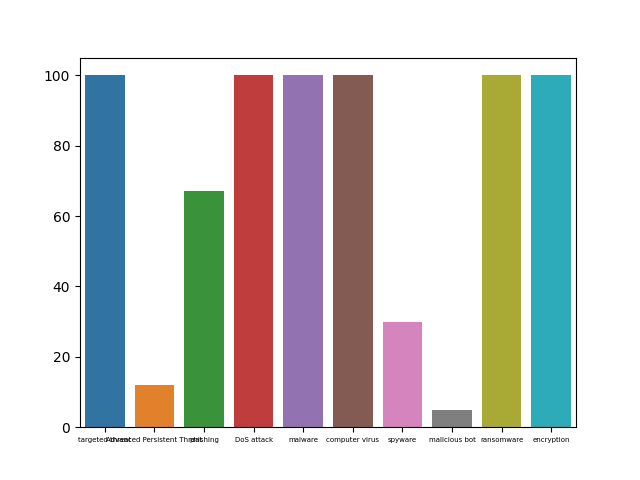
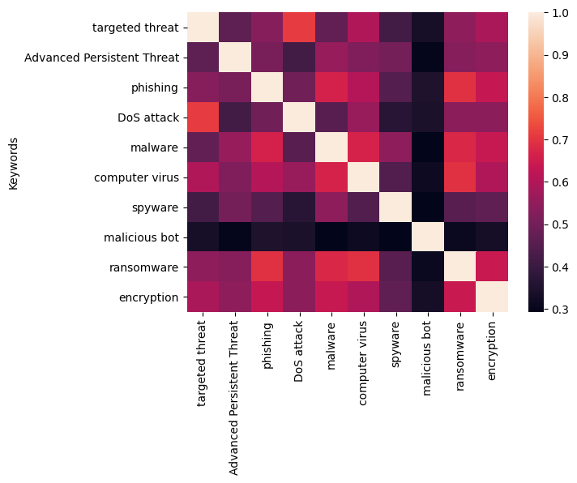

# Semantic-Keyword-Similarity-Mapper
Using NLP to scrape news articles for specified keywords, analysing semantic distances using word embeddings (GloVe), and visualising keyword relationships through heatmaps and bar charts. Built with BeautifulSoup, Gensim, OpenPyXL, and Seaborn.

My program initially uses the BBC search functionality and enters the keyword in question as the search parameter. It then stores the relevant BBC News articles that the BBC search returns. Then, it navigates to each of these article URLs and grabs the contents of the article, and stores them to a file. The program only stores the raw article data to the file and strips out any HTML that exists on the web page. The final result is that, for every keyword, a file called ```[keyword].txt``` is created, which contains an amalgamation of the contents of every BBC News article that has been collected from BBC that corresponds to that keyword. The image below shows the number of articles that were collected per keyword, when the program was run on 23rd April 2021. Note that any data in this report is subject to change depending on the behaviour of the BBC search functionality, so the data below is just an example of possible results. It is worth noting that for ‘Advanced Persistent Threat’, ‘spyware’, and especially ‘malicious bot’, the number of relevant news articles that BBC returned when these keywords were entered as the search parameter is significantly lower than others.



My program then calculates the semantic distance (a number between 0 and 1 that represents the semantic similarity between the two keywords) between any two keywords by using the data in those keywords’ files. For my algorithm, the larger the semantic distance, the more semantically similar the two keywords are, so a semantic distance of 1 means that the two keywords are identical.

Each document (i.e the text from the ```[keyword].txt``` file, which I will now refer to as ‘documents’) is initially pre-processed. This (a) strips out any miscellaneous web URLs that may still exist in the article contents, which are obviously not words, and (b) strips out any stopwords. These are words such as ‘and’, ‘because’, ‘to’ etc. that do not add any real meaning to the articles and will just act as clutter - so we remove them to retain just the meaningful words. We download the list of stopwords from the ```nltk``` package.

My algorithm makes use of the word embedding model known as ```Glove```. This is a machine learning algorithm that operates in a multi dimensional arena; it assigns words in a document to a numerical vector, and clusters these words with other words that they tend to appear alongside, considering them to be more similar. It does this by initially creating a dictionary that contains every single unique word that appears across all the documents. Then, it creates a similarity matrix, which stores the similarity between every pair of words in the dictionary, which is determined by the word frequency (via a TFIDF Model, which considers how frequently a word appears across multiple documents). We establish a ‘query’ and a ‘corpus’; the query is the document of the keyword which we are calculating semantic distances from, and the corpus is a list of the documents corresponding to the other keywords, so that we can calculate the semantic distance from the original keyword to each of the others. We then calculate the ‘soft cosine similarity’ between the query and each document. Recall that the words had previously been represented by vectors by the Glove model. The cosine similarity works by calculating the angle between the vectors, which is a more accurate way of determining similarity than calculating the distance between them, since the dimension space is very large and may often have vectors spaced very far apart. The ‘soft’ part means that the similarity between the words is also considered, e.g ‘car’ and ‘cars’ are not considered to be two completely different words with different meanings.

The image below is a heatmap that visually displays the data from ```distance.xlsx``` once the semantic distances between the keywords have been populated into it:


